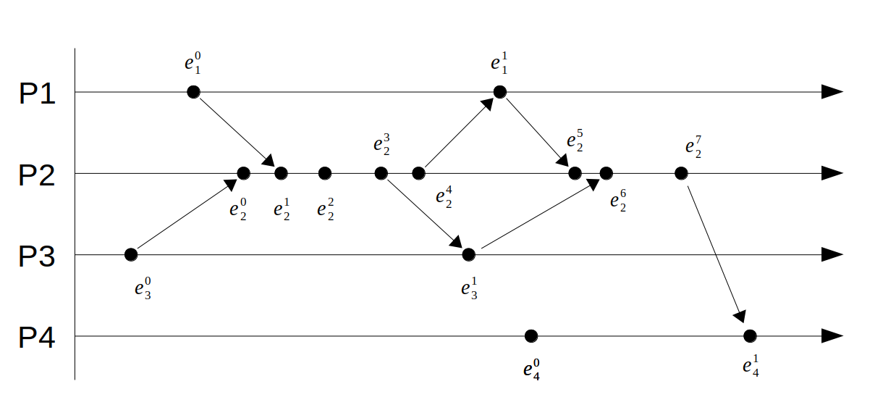
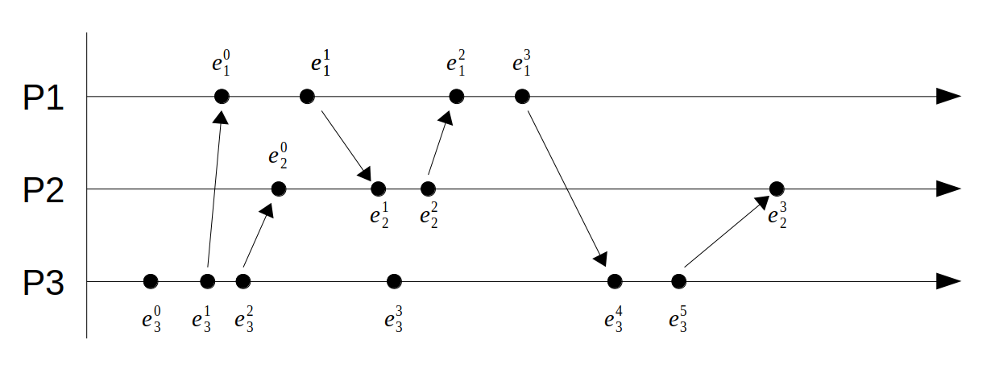
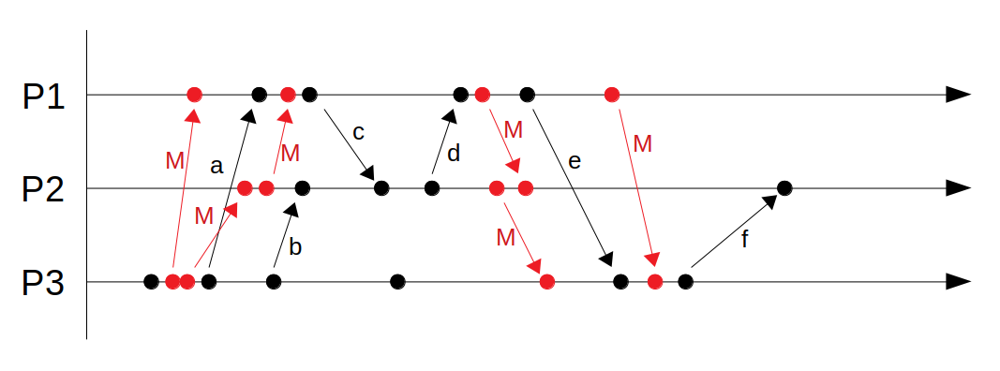

# Pauta I2

## Pregunta 1 (15 pts): Pastry Routing

Escribe un ejemplo de ruteo en que a un nodo le tome 4 saltos en encontrar a otro. Para esto debe considerar lo siguiente:

* Los equipos llevan mucho tiempo conectados a la red
* Los GUID están formado por 4 caracteres, cada uno representa un dígito hexadecimal
* Los *leaf sets* están formados por 5 elementos.
* Las tablas de ruteo tienen 4 niveles.
* Se deben dar, al menos, 2 saltos en nodos que estén en los *leaf sets*

Para esto deberás indicar claramente el GUID del equipo en que te encuentras, el *leaf set* y la tabla de ruteo (sólo si debes ocuparla) para cada uno de los pasos.

Recuerda que al saltar usando la tabla de ruteo, puedes llegar a un equipo con el prefijo al que saltaste.

### Solución

**Pauta:** Puede ser cualquier equipo, el algortimo debe llevarse a cabo correctamente.
Si solo se hace salto en *leaf set* hay que revisar que sean correctos
dividir el puntaje acorde a los saltos.

#### Paso 1

Somos el node `2345` y estamos buscando al `D4F4`.

```
Leafset

2341
2342
2345
2346
2348

```

Como no está en el *leaf set* (ni en su vecindad), buscamos en la tabla de ruteo:

| p |||||||||||||||||
|---|------|------|------|------|------|------|------|------|------|------|------|------|------|------|------|------|
| 0 | 0     | 1     | 2     | 3     | 4     | 5     | 6     | 7     | 8     | 9     | A     | B     | C     | **D**  | E     | F     |
| 1 | 20    | 21     | 22    | 23    | 24    | 25    | 26    | 27    | 28    | 29    | 2A    | 2B    | 2C    | 2D    | 2E    | 2F    |
| 2 | 230   | 231   | 232   | 233   | 234   | 235   | 236   | 237   | 238   | 239   | 23A   | 23B   | 23C   | 23D   | 23E   | 23F   |
| 3 | 2340 | 2341 | 2342 | 2343 | 2344 | 2345 | 2346 | 2347 | 2348 | 2349 | 234A | 234B | 234C | 234D | 234E | 234F |

Vamos a saltar hacia el nodo **D**. Esto nos hará llegar al equipo `D222`.

#### Paso 2

Estamos en el nodo `D222` y estamos buscando al equipo `D4F4`.

```
Leafset

D219
D221
D222
D225
D228

```

Como no está en el *leaf set* (ni en su vecindad), buscamos en la tabla de ruteo:

| p |||||||||||||||||
|---|------|------|------|------|------|------|------|------|------|------|------|------|------|------|------|------|
| 0 | 0     | 1     | 2     | 3     | 4     | 5     | 6     | 7     | 8     | 9     | A     | B     | C     | D  | E     | F     |
| 1 | D0    | D1     | DD    | D3    | **D4**    | D5    | D6    | D7    | D8    | D9    | DA    | DB    | DC    | DD    | DE    | DF    |
| 2 | D20   | D21   | D22   | D23   | D24   | D25   | D26   | D27   | D28   | D29   | D2A   | D2B   | D2C   | D2D   | D2E   | D2F   |
| 3 | D220 | D221 | D222 | D223 | D224 | D225 | D226 | D227 | D228 | D229 | D22A | D22B | D22C | D22D | D22E | D22F |

Vamos a saltar hacia el nodo **D4**. Esto nos hará llegar al equipo `D4F2`.

#### Paso 3

Estamos en el nodo `D4F2` y estamos buscando al equipo `D4F4`.

```
Leafset

D4EF
D4F1
D4F2
D4F5
D4F8

```


Vamos a saltar hacia el nodo **D4F5** (que está en la vecindad del *leaf set*).

**Pauta:** Para saltar dento del *leaf set* debe estar dentro del rango de este. Como los GUID son circulares, sabemos que el nodo `D4F5` es mayor que `D4EF` y menor que `D4F8`, por esta razón se salta en el *leaf set*.


#### Paso 4

Estamos en el nodo `D4F5` y estamos buscando al equipo `D4F4`.

```
Leafset

D4F1
D4F4
D4F5
D4F7
D4F8

```


Vamos a saltar hacia el nodo **D4F4** (que está en el *leaf set*). Y lo encontramos!


## Pregunta 2 (20 pts): Sincronización de Relojes

Para los siguientes procesos indica lo siguiente:



1. (4 pts) *Lamport timestamps* para estos procesos
2. (4 pts) *Vector clocks* para estos procesos
3. (8 pts) ¿En qué casos el primer método no nos entrega tanta información como el segundo? Responde con un ejemplo aplicado a los procesos de más arriba.
4. (4 pts) ¿Cuales son las desventajas del segundo metodo?


### Solución

**Nota:** Utilizaremos e_{proceso}^{n° evento} para referirnos a un evento en particular.
**Pauta:** Existe un error en el diagrama de procesos, ya que hay dos eventos que comparten un *send* y *recv*. Los alumnos pueden agregar un evento o sólo colocar un número para ese evento.

#### Pregunta 1

```
e_{1}^{0} = 1
e_{3}^{0} = 1
e_{4}^{0} = 1
```

**Pauta:** Si no tiene esto bien, solo puede optar a la mitad del puntaje
```
e_{2}^{0} = 2
e_{2}^{1} = 3
e_{2}^{2} = 4
e_{2}^{3} = 5
e_{2}^{4} = 6

e_{1}^{1} = 7
e_{3}^{1} = 6

e_{2}^{5} = 8
e_{2}^{6} = 9

e_{2}^{7} = 10

e_{4}^{1} = 11
```

#### Pregunta 2
```
e_{1}^{0} = [1, 0, 0, 0]
e_{3}^{0} = [0, 0, 1, 0]
e_{4}^{0} = [0, 0, 0, 1]
```
**Pauta:** Si no tiene esto bien, solo puede optar a la mitad del puntaje

```
e_{2}^{0} = [0, 1, 1, 0]
e_{2}^{1} = [1, 2, 1, 0]
e_{2}^{2} = [1, 3, 1, 0]
e_{2}^{3} = [1, 4, 1, 0]
e_{2}^{4} = [1, 5, 1, 0]

e_{1}^{1} = [2, 5, 1, 0]
e_{3}^{1} = [1, 4, 2, 0]

e_{2}^{5} = [2, 6, 1, 0]
e_{2}^{6} = [2, 7, 2, 0]

e_{2}^{7} = [2, 8, 2, 0]

e_{4}^{1} = [2, 8, 2, 2]
```

#### Pregunta 3

En este caso, los vectores siempre nos darán mayor información debido a que sabemos cuáles son los estados en los otros procesos. Esto justamente con *Lamport timestamps* no lo podemos obtener.

Si miramos al final de cada proceso tenemos los vectores:

```
V(P1) = [2, 5, 1, 0]
V(P2) = [2, 8, 2, 0]
V(P3) = [1, 4, 2, 0]
V(P4) = [2, 8, 2, 2]
```

Podemos concluir que `e_{4}^{1}` fue el último evento, `e_{2}^{7}` el anterior y los otros son concurrentes. Esto con el otro método no es posible de concluir ya que finalmente uno sólo tiene un número.

**Pauta:** Pueden existir otras explicaciones.

#### Pregunta 4

Las deventajas son claras, entregar un vector indica que el mensaje que voy a entregar es bastante más grande que otros mensajes. Por lo que hay un mayor uso de red.

**Pauta:** Pueden haber otro motivos, pero este debe estar ya que es el más evidente.


## Pregunta 3 (25 pts): Procesos y estados

Para el siguiente conjunto de procesos, indica lo siguiente:



1. (5 pts) Un corte consistente y uno inconsistente. Indica claramente las fronteras.
2. (5 pts) Dos linearizaciones para estos procesos.
3. (15 pts) Indica los estados finales para el algortimo de *snapshot* de Chandy - Lamport iniciado por el proceso *p3* después de su primer evento. A continuacion puedes ver cómo se enviaron los mensajes de *marker*:



### Solución

#### Pregunta 1

* Corte consistente: < e_{3}^{4}, e_{2}^{2}, e_{1}^{3} >
* Corte inconsistente: < e_{3}^{4}, e_{2}^{2}, e_{1}^{2} >

**Pauta:** Corte inconsistente es cualquiera que tenga un *recv* sin un *send*. Corte consistente en otro caso. Pueden ser otros valores pero tienen que cumplir con lo indicado anteriormente.


#### Pregunta 2

* L1: e_{3}^{0} -> e_{3}^{1} -> e_{1}^{0} -> e_{3}^{2} -> e_{2}^{0} -> e_{1}^{1} -> e_{2}^{1} -> e_{2}^{2} -> e_{3}^{3}  -> e_{1}^{2} -> e_{1}^{3} -> e_{3}^{4} -> e_{3}^{5} -> e_{2}^{3}
* L1: e_{3}^{0} -> e_{3}^{1} -> e_{1}^{0} -> e_{3}^{2} -> e_{1}^{1} -> e_{2}^{0} -> e_{2}^{1} -> e_{2}^{2} -> e_{3}^{3}  -> e_{1}^{2} -> e_{1}^{3} -> e_{3}^{4} -> e_{3}^{5} -> e_{2}^{3}

**Pauta:** Las respuestas deberían ser parecidas a esto. Sólo se puede alternar e_{1}^{1} con e_{2}^{0} (son concurrentes) y también se puede cambiar e_{3}^{3} con cualquier evento que ocurra después de e_{3}^{2} y e_{3}^{4} (es concurrente con todos ellos).


#### Pregunta 3

* Proceso P1
    * Estado se guarda en el momento de recibir el marker
    * Ch31 = {a}
    * Ch21 = {d}

* Proceso P2
    * Estado se guarda en el momento de recibir el marker
    * Ch12 = {}
    * Ch32 = {b}

* Proceso P3
    * Estado se guarda en el momento de recibir el marker
    * Ch13 = {e}
    * Ch23 = {}

**Pauta:** 5 puntos por cada uno de los procesos. Se debe indicar que cada proceso guarda su estado hasta ese punto, es parte del algoritmo.